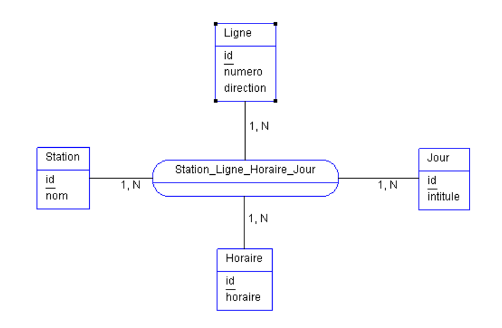

# Projet SQL - README

## Table des matières
- [Projet SQL - README](#projet-sql---readme)
  - [Table des matières](#table-des-matières)
  - [Instructions pour lancer les scripts SQL](#instructions-pour-lancer-les-scripts-sql)
  - [Conception](#conception)
    - [Dictionnaire des données](#dictionnaire-des-données)
      - [Horaire](#horaire)
          - [Index](#index)
      - [Jour](#jour)
          - [Index](#index-1)
      - [Ligne](#ligne)
          - [Index](#index-2)
      - [Station](#station)
          - [Index](#index-3)
      - [Station\_Ligne\_Horaire\_Jour](#station_ligne_horaire_jour)
          - [Index](#index-4)
      - [Index de la table Station\_Ligne\_Horaire\_Jour](#index-de-la-table-station_ligne_horaire_jour)
    - [Modèle conceptuel des données (MCD)](#modèle-conceptuel-des-données-mcd)

## Instructions pour lancer les scripts SQL
Voici les instructions pour exécuter les scripts SQL dans l'ordre indiqué :

1. Ouvrez votre terminal de commande dans ce fichier
2. Connectez-vous à votre base de données MySQL en utilisant la commande suivante : `mysql -u username -p`
3. Une fois connecté, vous pouvez créer une nouvelle base de données en utilisant la commande `CREATE DATABASE kiceo;`
4. Vous pouvez ensuite taper la commande `USE kiceo;` afin d'utiliser cette base de données pour les prochaines instructions
5. Pour exécuter un script SQL, utilisez la commande source suivie du chemin d'accès au fichier SQL.
   1. Nous commençons par lancer le script de créations de tables : `source schema.sql`
   2. Puis le script pour remplir ces tables avec les données : `source data.sql`
   3. Et enfin le script effectuant les requêtes demandées : `source requetes.sql`

## Conception

### Dictionnaire des données

**kiceo**

#### Horaire

|**Colonne**|**Type**|**Null**|**Valeur par défaut**|**Commentaires**|
| - | - | - | - | - |
|id *(Primaire)*|int|Non|||
|horaire|time|Oui|*NULL*||

###### Index

|**Nom de l'index**|**Type**|**Unique**|**Compressé**|**Colonne**|**Cardinalité**|**Interclassement**|**Null**|**Commentaire**|
| - | - | - | - | - | - | - | - | - |
|PRIMARY|BTREE|Oui|Non|id|32|A|Non||

#### Jour

|**Colonne**|**Type**|**Null**|**Valeur par défaut**|**Commentaires**|
| - | - | - | - | - |
|id *(Primaire)*|int|Non|||
|intitule|varchar(255)|Oui|*NULL*||

###### Index

|**Nom de l'index**|**Type**|**Unique**|**Compressé**|**Colonne**|**Cardinalité**|**Interclassement**|**Null**|**Commentaire**|
| - | - | - | - | - | - | - | - | - |
|PRIMARY|BTREE|Oui|Non|id|1|A|Non||

#### Ligne

|**Colonne**|**Type**|**Null**|**Valeur par défaut**|**Commentaires**|
| - | - | - | - | - |
|id *(Primaire)*|int|Non|||
|numero|int|Oui|*NULL*||
|direction|varchar(255)|Oui|*NULL*||

###### Index

|**Nom de l'index**|**Type**|**Unique**|**Compressé**|**Colonne**|**Cardinalité**|**Interclassement**|**Null**|**Commentaire**|
| - | - | - | - | - | - | - | - | - |
|PRIMARY|BTREE|Oui|Non|id|2|A|Non||

#### Station

|**Colonne**|**Type**|**Null**|**Valeur par défaut**|**Commentaires**|
| - | - | - | - | - |
|id *(Primaire)*|int|Non|||
|nom|varchar(255)|Oui|*NULL*||
|indisponible|tinyint(1)|Oui|0||

###### Index

|**Nom de l'index**|**Type**|**Unique**|**Compressé**|**Colonne**|**Cardinalité**|**Interclassement**|**Null**|**Commentaire**|
| - | - | - | - | - | - | - | - | - |
|PRIMARY|BTREE|Oui|Non|id|8|A|Non||

#### Station\_Ligne\_Horaire\_Jour

|**Colonne**|**Type**|**Null**|**Valeur par défaut**|**Commentaires**|
| - | - | - | - | - |
|id\_Ligne *(Primaire)*|int|Non|||
|id\_Station id\_Station *(Primaire)*|int|Non|||
|id\_Horaire *(Primaire)*|int|Non|||
|id\_Jour id\_Jour *(Primaire)*|int|Non|||

###### Index

#### Index de la table Station_Ligne_Horaire_Jour

|**Nom de l'index**|**Type**|**Unique**|**Compressé**|**Colonne**|**Cardinalité**|**Interclassement**|**Null**|**Commentaire**|
| - | - | - | - | - | - | - | - | - |
|id_Ligne|A|Non|Non|id_Ligne|48|A|Non||
|id_Station|A|Non|Non|id_Station|48|A|Non||
|PRIMARY|BTREE|Oui|Non|id_Station, id_Horaire, id_Jour|48|A|Non||
|id_Horaire|A|Non|Non|id_Horaire|48|A|Non||
|id_Jour|A|Non|Non|id_Jour|48|A|Non||
|FK_Station_Ligne_Horaire_id_Station|BTREE|Non|Non|id_Station|48|A|Non||
|FK_Station_Ligne_Horaire_id_Horaire|BTREE|Non|Non|id_Horaire|48|A|Non||
|FK_Station_Ligne_Horaire_id_Jour|BTREE|Non|Non|id_Jour|48|A|Non||

### Modèle conceptuel des données (MCD)
Le modèle conceptuel des données (MCD) est disponible au format PNG. 
